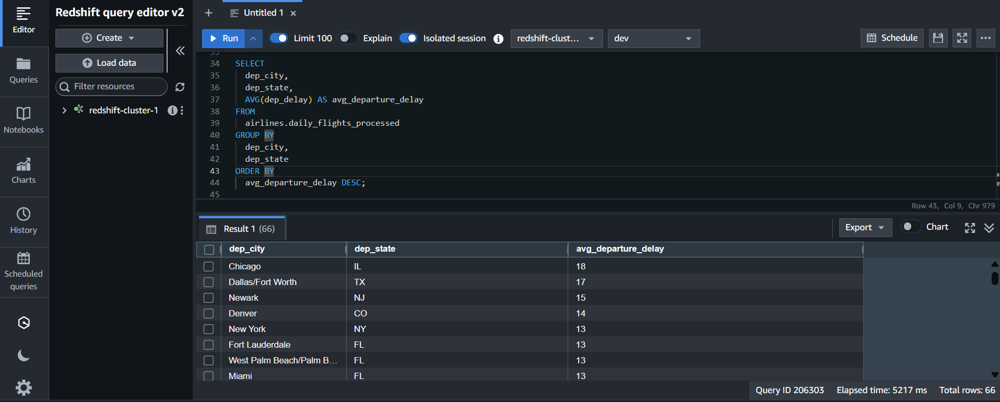

# End-to-End Event-Driven Incremental ETL Pipeline on AWS

Production-grade, serverless data pipeline that reliably processes and enriches daily airline flight data—automating the entire flow from S3 landing to a clean Redshift fact table.

[](https://aws.amazon.com/)
[](https://www.python.org/)
[](https://spark.apache.org/)
[](https://aws.amazon.com/s3/)
[](https://aws.amazon.com/step-functions/)
[](https://aws.amazon.com/glue/)
[](https://aws.amazon.com/glue/)
[](https://aws.amazon.com/glue/catalog/)
[](https://aws.amazon.com/redshift/)
[](https://aws.amazon.com/eventbridge/)
[](https://aws.amazon.com/sns/)

▶️ **Watch the Full Demo (Code, UI, Results)** [LOOM DEMO LINK]

**🔗Architecture [Project Architecture](Screenshots/Architecture.png)**

**📊Jump to Results & Validation [Execution–results](#business-impact--real-world-applications)**


-----

## TL;DR for Recruiters (30-Sec Summary)

  - **What it does:** Automates the daily ingestion and enrichment of raw flight data, joining it with a Redshift dimension table to load a clean fact table.
  - **Technical stack:** **PySpark** + **AWS Serverless** (Glue, Step Functions, EventBridge) + **Redshift** + **SNS Alerting**.
  - **Key Features:** **Incremental processing** using AWS Glue Job Bookmarking; **Robust orchestration** with Step Functions to manage Glue Crawler/Job dependencies.
  - **Real-world impact:** Ensures zero-ops automation, data quality (enriched city/airport names), and cost optimization by avoiding full data scans.
  - **Production features:** Event-driven trigger, automated dependency management via Step Function polling, and immediate success/failure notifications via SNS.

-----

## Core Skills

  - **Data Processing:** PySpark (AWS Glue DynamicFrames, Transformations, Two-Pass Joins).
  - **Orchestration:** AWS Step Functions (State Machine design, Task/Choice/Wait states, Synchronous Glue execution).
  - **Cloud Platform:** AWS (S3, Glue, Redshift, EventBridge, SNS, IAM Role management).
  - **Architecture:** Serverless, Event-Driven, Incremental ETL, Data Lake/Warehouse Integration.
  - **Language:** Python, SQL

-----

## Quick Start Guide

### 🎯 For Recruiters (1 min)
Get a quick snapshot of the project and impact:

[Business Impact & Applications](#business-impact--real-world-applications)  → [Highlights](#architecture)

### 👨‍💻 For Engineers (5 min)
Jump directly to technical implementation details:

[Pipeline Components](#pipeline-components) → [Project Architecture](Screenshots/Architecture.png) → [Code Files](#-code-files)

### 🔍 For Hiring Managers (2 min)
Focus on results, production features, and architecture overview:

[Results & Metrics](#execution--results) → [Production-Ready Features](#production-ready-features) → [Project Architecture](Screenshots/Architecture.png)

-----

### 📊 Impact at a Glance

| Metric | Before (Manual or Basic Batch) | After (This Pipeline) | Improvement |
|:---|:---|:---|:---|
| **Pipeline Trigger** | Cron/Manual Job Scheduler | Event-Driven (S3 Object Created) | **100% Automation** 🤖 |
| **Data Volume Processed** | All files every run | Only **New** files (via Bookmarking) | **Cost Efficiency** 💸 |
| **Dependency Management** | Simple task chain or manual check | Automated **Crawler Polling** (Step Functions) | **Zero Race Conditions** 🛡️ |
| **Data Quality (Enrichment)** | Raw IDs (`OriginAirportID`) | Full Names (`dep_city`, `arr_airport`) | **Analytics Ready** ✅ |
| **Error Alerting** | Logs only | Instant SNS Notification | **Immediate Response** 📧 |

-----

## Technologies & Tools

**Cloud Platform**: AWS (S3, Glue, Redshift, EventBridge, Step Functions, SNS)
**Orchestration**: AWS Step Functions
**Data Processing**: AWS Glue (PySpark)
**Data Warehouse**: Amazon Redshift
**Storage**: Amazon S3
**Language**: Python, SQL

**Key AWS Services & Concepts**:

  - **AWS EventBridge**: Triggers the state machine upon S3 file creation.
  - **AWS Glue Crawler**: Registers metadata for raw S3 data and Redshift dimensions.
  - **AWS Step Functions**: Orchestrates the sequential execution of Crawler $\rightarrow$ Glue Job, including conditional polling.
  - **Glue Job Bookmarking**: Enables **incremental processing** by tracking processed S3 data partitions.
  - **`glue:startJobRun.sync`**: Ensures the orchestrator waits for the ETL job to complete before proceeding.
  - **AWS SNS**: Provides immediate success and failure notifications for the entire workflow.

-----

## Pipeline Components

This project implements a fully serverless, end-to-end data pipeline for daily flight data ingestion.

1.  **Ingest:** New flight data files (`.csv`) land in the dedicated S3 raw bucket.
2.  **Trigger:** An **AWS EventBridge Rule** detects the S3 `Object Created` event with a `.csv` suffix and invokes the AWS Step Function.
3.  **Orchestrate (Crawler):** The Step Function starts the **Glue Crawler** and polls its status until it completes, ensuring the Glue Catalog is updated with new file metadata.
4.  **Process (ETL):** The Step Function triggers the **AWS Glue PySpark Job**. This job reads the raw incremental data from the catalog and the dimension table (`dim_airport_codes`) from Redshift.
5.  **Transform:** The Glue job performs a **two-pass join** (one for origin, one for destination) to enrich the data, resolving both `OriginAirportID` and `DestAirportID` to full city, state, and airport names.
6.  **Load:** The resulting enriched fact data is written to the target `daily_flights_processed` table in Redshift.
7.  **Alert:** The Step Function publishes a **Success or Failure message** to an SNS Topic, based on the outcome of the Glue Job.

-----

## Trade-offs and Design Rationale

This batch-oriented, event-driven architecture was chosen over alternative solutions based on the following engineering trade-offs:

| Design Choice | Rationale & Benefit | Trade-off (What was sacrificed) |
| :--- | :--- | :--- |
| **AWS Glue Job Bookmarking** | Guarantees **incremental processing**, drastically reducing processing time and cost by avoiding reprocessing old data. | Requires the source data to be partitioned correctly (e.g., by date) and is dependent on the stability of the S3 file structure. |
| **EventBridge + Step Functions** | Achieves **zero-ops automation** and centralizes **complex dependency management** (Crawler $\rightarrow$ Glue Job). | Introduces orchestration complexity (writing States Language) and slight latency while the Step Function polls the Glue Crawler. |
| **Glue Crawler Polling** | **Mitigates race conditions** by ensuring the Glue Catalog metadata is current before the ETL job attempts to read new partitions. | Adds a mandatory **wait time** (10 seconds minimum in this design) to the critical path, preventing true sub-second ingestion. |
| **Redshift Target** | Provides a highly performant **SQL data warehouse** for joins and BI reporting, which is superior for complex analytics. | Higher per-GB cost than writing to a simple Parquet lake (S3); requires managing Redshift connections and cluster sizing. |
| **Two-Pass Join** | Ensures full enrichment of both **departure and arrival details** in the final denormalized fact table using standard Glue/Spark joins. | Less efficient than a single complex SQL join in Redshift (ELT); requires intermediate memory/shuffle in Glue. |

-----

## Business Impact & Real-World Applications

The pipeline produces the **`daily_flights_processed`** table in Redshift, enabling valuable analytical queries

**1. Delay Analysis by Enriched Location**
*Impact*: Analysts can instantly identify the cities and states responsible for the longest average delays.

```sql
SELECT
  dep_city,
  dep_state,
  AVG(dep_delay) AS avg_departure_delay
FROM
  airlines.daily_flights_processed
GROUP BY
  dep_city,
  dep_state
ORDER BY
  avg_departure_delay DESC;
```


**2. Carrier Performance Comparison**
*Impact*: Management can compare the performance of different carriers based on average departure and arrival delays in a single query.

```sql
SELECT
  carrier,
  AVG(dep_delay) AS avg_dep_delay,
  AVG(arr_delay) AS avg_arr_delay,
  COUNT(*) AS total_flights
FROM
  airlines.daily_flights_processed
GROUP BY
  carrier
ORDER BY
  avg_dep_delay DESC;
```
**3. Route Optimization and Profitability Analysis**
*Impact*: Identify the specific flight routes (city to city) that have the highest frequency of severe delays, which directly impacts fuel costs and crew scheduling.

```sql
SELECT
  dep_city,
  arr_city,
  AVG(dep_delay + arr_delay) AS avg_total_delay_minutes
FROM
  airlines.daily_flights_processed
GROUP BY
  dep_city,
  arr_city
ORDER BY
  avg_total_delay_minutes DESC
LIMIT 10;
```

**4. Airport Congestion and SLA Monitoring**
*Impact*: Track total traffic volume and average delay per enriched airport to monitor congestion and ensure that airport operators are meeting Service Level Agreements (SLAs).

```sql
SELECT
  dep_airport,
  COUNT(*) AS total_flights,
  AVG(dep_delay) AS avg_dep_delay_minutes
FROM
  airlines.daily_flights_processed
GROUP BY
  dep_airport
HAVING
  total_flights > 100 -- Focus on airports with major volume
ORDER BY
  avg_dep_delay_minutes DESC;
```

**5. Predictive Maintenance and Fleet Flagging**
*Impact*: Identify the carrier with the highest proportion of severely delayed flights (\> 60 minutes). These patterns can serve as a trigger for the maintenance team to proactively inspect a specific fleet.

```sql
SELECT
  carrier,
  COUNT(*) AS total_flights,
  SUM(CASE WHEN dep_delay >= 60 THEN 1 ELSE 0 END) AS severe_delay_count,
  (severe_delay_count * 100.0) / total_flights AS pct_severe_delays
FROM
  airlines.daily_flights_processed
GROUP BY
  carrier
HAVING
  total_flights > 500 -- Focus on carriers with significant volume
ORDER BY
  pct_severe_delays DESC;
```

## 📁 Code Files

| File | Description | Key Features Demonstrated |
| :--- | :--- | :--- |
| **`glue_etl_job.py`** | PySpark script defining the ETL logic. | Glue Job Bookmarking, DynamicFrame operations, Two-Pass Join for enrichment, Redshift write. |
| **`step_function_config.json`** | Amazon States Language (ASL) definition for the orchestrator. | Crawler polling logic (`CheckAndWait`), Glue job sync (`startJobRun.sync`), SNS failure/success branching. |
| **`event_bridge_rule.json`** | Configuration for the S3 object creation trigger. | Event-Driven architecture, S3 bucket/suffix filtering. |
| **`redshift_create_table_commands.txt`** | SQL commands for creating the dimension and fact tables in Redshift. | Data Modeling (Star Schema), target schema design. |

-----

## Architecture

```
+-----------------------------------+
| S3 Raw Bucket (New .csv files)    |
+----------------------+------------+
                       |
                       v (S3:ObjectCreated Event)
+-----------------------------------+
| AWS EventBridge Rule              |
+----------------------+------------+
                       |
                       v (Target)
+-----------------------------------+
| AWS Step Function (Orchestrator)  |
| 1. StartFlightS3RawCrawler        |
| 2. GetCrawlerStatus (Polling Loop)|<-- DEPENDENCY MANAGEMENT
| 3. TriggerGlueJob (Sync)          |
+-------------+---------------------+
               |                    |
               v                    v
+--------------+-----------+ +-----------------+
| AWS Glue ETL Job (PySpark)| | SNS Topic       |<-- ALERTING
| - Bookmarking             | | - Success/Failure|
| - Enrichment Joins        | +-----------------+
+------+--------------------+
        |
        v
+-----------------------------------+
| Amazon Redshift                   |
| - dim_airport_codes               |
| - daily_flights_processed (Fact)  |
+-----------------------------------+
```

-----

## 📑 Data Model & Tables

### Data Model (Amazon Redshift)

**Dimension Table: `airlines.dim_airport_codes`**

  * **Purpose:** Static lookup table used for data enrichment.
  * **Schema (Input):** `airport_id` (BIGINT), `city` (VARCHAR), `state` (VARCHAR), `name` (VARCHAR).

**Fact Table: `airlines.daily_flights_processed`**

  * **Purpose:** Clean, enriched final output, appended to incrementally.
  * **Schema (Output - Denormalized):**
      * `carrier` (VARCHAR), `dep_delay` (BIGINT), `arr_delay` (BIGINT)
      * `dep_airport`, `arr_airport` (VARCHAR) - *Enriched*
      * `dep_city`, `arr_city` (VARCHAR) - *Enriched*
      * `dep_state`, `arr_state` (VARCHAR) - *Enriched*

-----

## Production-Ready Features

  - ✅ **Incremental Processing**: Utilizes **AWS Glue Job Bookmarking** to only process new partitions of data.
  - ✅ **Event-Driven Trigger**: Pipeline is completely automated via **AWS EventBridge** listening for S3 object creation.
  - ✅ **Automated Polling**: **Step Functions** implement polling logic to ensure the Glue Crawler completes before the main ETL job is initiated, preventing metadata failure.
  - ✅ **Synchronous Execution**: Uses `glue:startJobRun.sync` to treat the ETL job as a single, trackable task within the Step Function.
  - ✅ **Error Handling & Alerting**: Includes a **`Catch` block** in the Step Function to handle Glue Task Failures, immediately routing to an **SNS Notification**.

-----

## Execution & Results

The video demonstration confirms the pipeline's operational success:

1.  **Trigger:** A file upload to S3 initiates the workflow.
2.  **Monitor:** The AWS Step Functions graph view shows the State Machine executing all tasks successfully (green).
3.  **Validate:** The final SQL query on the Redshift fact table displays the fully enriched columns, confirming that the two-pass join successfully populated the departure and arrival city/airport names.

-----

## Future Enhancements

  - [ ] **Data Quality Checks**: Implement AWS Deequ within the Glue job to validate data quality (e.g., ensuring `DepDelay` is not null) before writing to Redshift.
  - [ ] **Infrastructure as Code (IaC)**: Migrate the Glue Job, Step Function, and EventBridge configurations to **AWS CloudFormation or Terraform** for full declarative deployment.
  - [ ] **Data Lineage**: Integrate a tool like **OpenLineage** with Glue to automatically track data lineage from S3 to Redshift.
  - [ ] **Optimize Redshift**: Implement partitioning on the Redshift fact table by a date/time column for improved query performance.

-----

## Author

**[YOUR NAME]**
Data Engineer | [YEARS] Experience
**LinkedIn**: [YOUR LINKEDIN PROFILE LINK]
**GitHub**: [YOUR GITHUB PROFILE LINK]

**Last Updated**: [MONTH YEAR] (e.g., November 2025)
